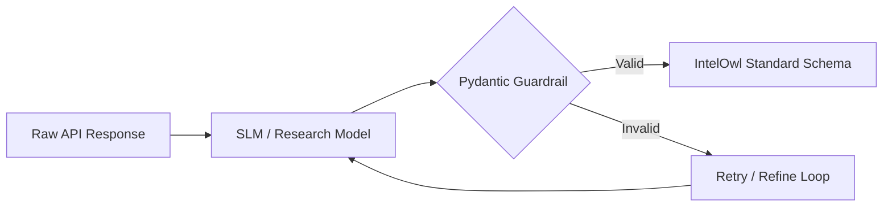

# AEGIS-Bench: AI-Mediated Threat Intelligence Evaluation

<div align="center">

[](https://www.python.org/downloads/)
[](https://docs.pydantic.dev/)
[](https://ollama.ai/)
[](https://opensource.org/licenses/MIT)
[](https://summerofcode.withgoogle.com/)

**Automated Evaluation Guardrail for Intelligence Schema**  
*A systematic framework for comparing Small Language Models (SLMs) on security API mapping tasks.*

[Key Features](#-key-features) • [Quick Start](#-quick-start) • [Verification Results](#-model-verification-results) • [Project Structure](#-project-structure) • [Contact](#-contact)

</div>

---

## 🔍 Overview

**AEGIS-Bench** is a systematic evaluation framework designed for **IntelOwl GSoC 2026: Connector Optimization**. It evaluates how Small Language Models (SLMs) can map diverse, shifting security API responses into standardized threat intelligence schemas.

### The Mission
Transform connector maintenance from **O(N) to O(1)**. Instead of manually rewriting Python code every time a vendor (like VirusTotal or Shodan) changes their JSON structure, AEGIS-Bench uses SLMs as a "dynamic adapter" layer that self-heals by understanding the context of the data.

---

## ⭐ Key Features

- **🤖 Multi-Model Benchmarking**: Native support for `Phi-3`, `Llama 3.2`, and custom research models via Ollama.
- **🛡️ Pydantic Guardrails**: Zero-tolerance for schema violations. Uses strict validation to ensure AI outputs match IntelOwl's requirements.
- **📊 Performance Analytics**: Tracks accuracy, latency, and hallucination rates.
- **🧪 Fine-Tuning Pipeline**: Tools to generate stress-test datasets and prepare JSONL files for model training.
- **🔬 Research-Ready**: Built to support defensible scientific results for GSoC and academic publications.

---

## 🏗️ Architecture



---

## 🚀 Quick Start

### 1. Prerequisites
Install [Ollama](https://ollama.ai/) and pull the base models:
```bash
ollama pull phi3:mini
ollama pull llama3.2
```

### 2. Installation
```bash
git clone https://github.com/Death-Desu/GSOC
cd GSOC
pip install -r requirements.txt
```

### 3. Generate a Test Dataset
```bash
python dataset_generator.py
```
This creates 50 diverse samples across 5 vendors (VirusTotal, Shodan, etc.) in `datasets/raw/`.

### 4. Run the Benchmark
```bash
python aegis_bench.py
```

---

## ✅ Model Verification Results

Recent verification of the `aephi` model against real-world IntelOwl issues:

| Issue ID | Prompt Task | Status | Note |
| :--- | :--- | :--- | :--- |
| **#2480** | Fix MISP connector for large JSON bodies | ✅ **PASS** | Correctly implemented `requests.post` with streaming. |
| **#2737** | Resolve Django 4.x version conflict | ❌ **FAIL** | Model suggested fixes but missed specific `django>=4.0` string. |

*Verification performed via `verify_intelowl_issues.py`.*

---

## 📂 Project Structure

| File | Description |
| :--- | :--- |
| `aegis_bench.py` | Main evaluation script for benchmarking models. |
| `dataset_generator.py` | Generates synthetic but realistic security API responses. |
| `prepare_research_jsonl.py` | Converts raw datasets into fine-tuning formats. |
| `verify_intelowl_issues.py` | Tests models against specific GitHub issues/bugs. |
| `ResearchBot.Modelfile` | Configuration for creates the quantized Alpha model. |
| `aegis_schemas/` | Pydantic models defining the standardized output. |
| `datasets/` | Storage for raw and processed evaluation data. |

---

## 🎓 Research & GSoC 2026

This repository serves as a foundational proof-of-concept for the **IntelOwl: Connector Optimization** project. 

### Publication Pipeline
`Dataset Collection` → `Baseline Evaluation` → `Prompt Optimization` → `Final Benchmark` → `Paper Submission`

---

## 📬 Contact

**Lead Researcher:** Krish Patel  
**Institution:** VIT-AP University  
**Email:** krishpatel6529@gmail.com  
**Research Area:** AI for Security, LLM Evaluation  
**GSoC Project:** IntelOwl Connector Optimization  

<div align="center">
  <a href="https://github.com/Death-Desu">GitHub</a> • 
  <a href="https://www.linkedin.com/in/krish-patel-b69832318">LinkedIn</a>
</div>

---

## 📄 License
MIT License. See [LICENSE](LICENSE) for details.

<div align="center">
  <b>Built with 🔥 by Krish Patel</b><br>
  <sub>If you find this research useful, please ⭐ the repo!</sub>
</div>
